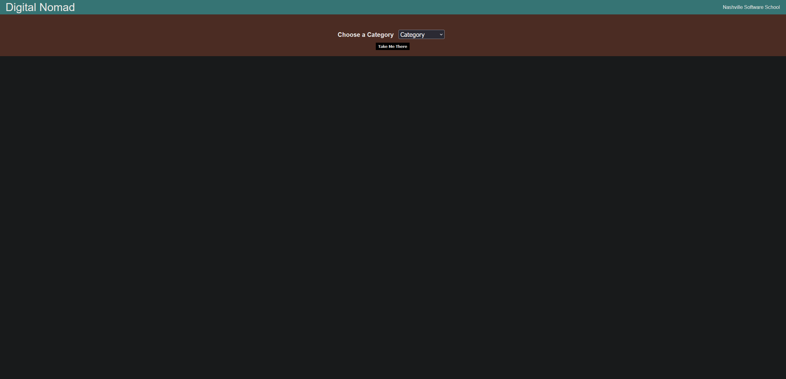

<!-- PROJECT SHIELDS -->
<!--
*** I'm using markdown "reference style" links for readability.
*** Reference links are enclosed in brackets [ ] instead of parentheses ( ).
*** See the bottom of this document for the declaration of the reference variables
*** for contributors-url, forks-url, etc. This is an optional, concise syntax you may use.
*** https://www.markdownguide.org/basic-syntax/#reference-style-links
-->

<!-- PROJECT LOGO -->
<br />
<div align="center">
    

<h3 align="center">Digital Nomad</h3>

  <p align="center">
    Find Your Destination
    <br />
  </p>
</div>

___


<h3>About The Project</h3>

<p>
Digital Nomad is a "mid-stone" group project at Nashville Software School. Contributors to this project include Alex Murillo, Erika Smith, Matt Marotta, and Steve Winters.
Digital Nomad is a service that allows users to search for travel destinations based on criteria such as access to beaches, night life, etc. Users are then provided a list of potential destinations, which they can then save for later viewing at a provided URL.
<br><br>


</p>
<p align="center">
<a href="https://github.com/Cyber-Scythe/DigitalNomad">View Demo</a> 
· 
<a href="https://github.com/Cyber-Scythe/DigitalNomad/issues">Report Bug</a> 
·
<a href="https://github.com/Cyber-Scythe/DigitalNomad/issues">Request Feature</a>
</p>

---

<!-- BUILT WITH -->
### Built With

* </a>
* </a>
* </a>
* </a>
* </a>
* </a>
* </a>
* </a>

<p>(<a href="#readme-top">back to top</a>)</p>

---

<!-- GETTING STARTED -->
## Getting Started

The following instructions are for setting up this project locally.


## Setup

1. Use an Amazon AWS account.
2. Install AWS CLI. [Documentation](https://docs.aws.amazon.com/cli/latest/userguide/getting-started-install.html)
3. Install AWS SAM CLI. [Documentation](https://docs.aws.amazon.com/serverless-application-model/latest/developerguide/install-sam-cli.html)
4. Install NodeJS to run the npm commands below.

- For Windows / WSL users:
```shell
curl -fsSL https://deb.nodesource.com/setup_18.x | sudo -E bash - &&\
sudo apt-get install -y nodejs
```
- For Mac users:
```shell
brew install node
```

5. Install Docker <br><br>
   [Linux](https://docs.docker.com/desktop/install/) <br>
   [Mac](https://docs.docker.com/desktop/install/mac-install/) <br>
   [Windows](https://docs.docker.com/desktop/install/windows-install/) <br>

### Backend Setup via Lambda Service
1. Build the Java code: `sam build`
2. Create an S3 bucket: `aws s3 mb s3://YOUR_BUCKET`
3. Deploy the SAM template: `sam deploy --s3-bucket BUCKET_FROM_ABOVE --parameter-overrides S3Bucket=BUCKET_FROM_ABOVE FrontendDeployment=local`
   > **NOTE:** _Yes you have to provide the same S3 bucket name twice. Yes this is annoying._
4. Run the local API: `sam local start-api --warm-containers LAZY`


### Frontend Setup
1. CD into the web directory: `cd web`
2. Install dependencies : `npm install`
3. Run the local server: `npm run run-local`


After the steps above, you will have a server running on port `8000` - you can access it via [http://localhost:8000](http://localhost:8000) in your web browser.


### Installation

1. Clone the repo
   ```bash
   git clone https://github.com/Cyber-Scythe/DigitalNomad.git
   ```
2. Install NPM packages
   ```bash
   npm install
   ```

<p align="left">(<a href="#readme-top">back to top</a>)</p>

---

### View This Project

<p>View this project: <a href="https://youtu.be/dHkNxV84Lhk"><b>here</b></a>.</p>

---

<!-- CONTRIBUTING -->
## Contributing

Contributions are what make the open source community such an amazing place to learn, inspire, and create. Any contributions you make are **greatly appreciated**.

If you have a suggestion that would make this better, please fork the repo and create a pull request. You can also simply open an issue with the tag "enhancement".
Don't forget to give the project a star! Thanks again!

1. Fork the Project
2. Create your Feature Branch (`git checkout -b feature/AmazingFeature`)
3. Commit your Changes (`git commit -m 'Add some AmazingFeature'`)
4. Push to the Branch (`git push origin feature/AmazingFeature`)
5. Open a Pull Request

<p align="left">(<a href="#readme-top">back to top</a>)</p>


---

<!-- CONTACT -->
## Contact

Erika Smith:  erikadaniellesmith@gmail.com
<br>
<a href="https://www.linkedin.com/in/erika-smith-dev/">
</a>
<br>
<a href="https://github.com/Cyber-Scythe/">
</a>


<p align="left">(<a href="#readme-top">back to top</a>)</p>

---

<!-- ACKNOWLEDGMENTS -->
## Acknowledgments
The following people contributed to the development of this project
* Alex Murillo
  <a href="https://github.com/emergency22">
  </a>
  <br>
* Matt Marotta
  <a href="https://github.com/MattMarotta94">
  </a>
  <br>
* Steve Winters
  <a href="https://github.com/winters5885">
  </a>

<p align="left">(<a href="#readme-top">back to top</a>)</p>

<!-- MARKDOWN LINKS & IMAGES -->
<!-- https://www.markdownguide.org/basic-syntax/#reference-style-links -->

